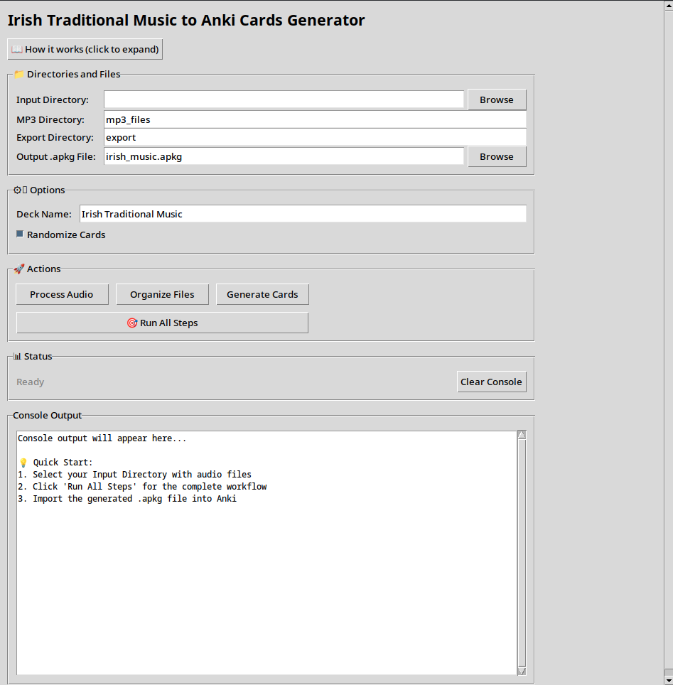

# Irish Traditional Music Anki Cards

**Instruction en Français plus bas**
**Teagasc sa Ghaeilge (aistrithe go huathoibríoch) thíos**

This tool generates Anki flashcards from Irish traditional music files. It uses ffmpeg for audio conversion and [The Session](https://thesession.org/) to automatically find metadata (key, rhythm, proper title) for each tune. 

**Note**: This tool does not provide music files - you must bring your own legally obtained Irish traditional music collection, for example by ["ripping your own albums"](https://github.com/makuguren/Spotify-Playlist-Downloader) or ["recording yourself"](https://github.com/yt-dlp/yt-dlp).




- **Audio conversion** from various formats (m4a, wav, flac, aac, ogg, mp4, webm) to mp3 using ffmpeg
- **Respectful web scraping** of thesession.org with appropriate delays
- **Smart tune matching** that handles "The " prefixes and variations
- **Automatic file organization** by rhythm (jigs, reels, polkas, etc.)
- **Customizable card layouts** - choose what appears on front/back (name, audio, key, rhythm)
- **Anki card generation** with audio files and metadata

## Usage

## 🚀 Quick Start

### Option 1: Use the GUI (Recommended)

**Windows Users**: Download the latest `IrishAnki.exe` from [Releases](../../releases) - no installation required

**Linux/Mac Users**: 
```bash
# Clone and setup
git clone <this-repository>
cd anki-irish
python -m venv venv
source venv/bin/activate  # On Windows: venv\Scripts\activate
pip install -r requirements.txt

# Run the GUI
python gui.py
```

### Using the GUI:

1. **📁 Select Input Directory**: Click "Browse" to navigate and visually confirm your audio files
2. **⚙️ Configure Options**: Set output paths and deck name (defaults work great!)
3. **🎴 Customize Card Layout**: Choose what appears on front/back of your Anki cards
4. **🎯 Click "Run All Steps"**: Sit back and watch the magic happen
5. **📱 Import to Anki**: Double-click the generated `.apkg` file

## 🎵 How It Works

The workflow transforms your raw audio files into organized Anki cards:

**Audio Files → MP3 → Organized by Rhythm → Anki Deck**

1. **🎵 PROCESS**: Converts audio formats (.m4a, .wav, .flac, etc.) to MP3 or copies existing MP3s
2. **🗂️ ORGANIZE**: Searches thesession.org for metadata and organizes by rhythm  
3. **🎴 GENERATE**: Creates Anki .apkg file with audio cards

## 🎯 Example Workflow

```
Input Directory:
├── Cooley's Reel.m4a
├── The Kesh Jig.wav
├── Superfly.wav
├── Bill Sullivan's Polka.mp3
└── Random Song.flac

After Processing:
export/
├── reel/
│   ├── Superfly (Bmin).mp3
│   └── Cooley's (Edor).mp3
├── jig/
│   └── The Kesh (Gmaj).mp3
├── polka/
│   └── Bill Sullivan's (Amaj).mp3
├── unknown/
│   └── Random Song.mp3
└── irish_music.apkg  ← Ready to import!
```

## 📱 Anki Import

### Desktop Anki
1. Double-click the generated `.apkg` file, or
2. File → Import → select the `.apkg` file

### AnkiDroid (Android)
1. Install AnkiDroid from Google Play Store
2. Copy the `.apkg` file to your device
3. Open AnkiDroid → Menu (⋮) → Import
4. Select the `.apkg` file

### Card Format

**Default Layout**:
- **Front**: 🎵 Audio file of the tune (tap to play)  
- **Back**: 🏷️ Name + 🎼 Key + 🎭 Rhythm

**Customizable Options**:
- **🏷️ Name**: The tune's title (e.g., "Cooley's Reel")
- **🎵 Audio**: Playable audio file
- **🎼 Key**: Musical key (e.g., "Edor", "Gmaj")  
- **🎭 Rhythm**: Type of tune (e.g., "reel", "jig", "polka")

**Suggested Layouts**:
- **Audio-first** (default): 🎵 → 🏷️🎼🎭
- **Name-first**: 🏷️ → 🎵🎼🎭  
- **Key training**: 🎵 → 🎼

## ⚙️ Advanced Usage (Command Line)

For automation or advanced users, the command-line interface is still available:

### Complete Workflow
```bash
python irish_anki.py all <input_directory>
```

### Individual Steps
```bash
# 1. Convert audio files to mp3
python irish_anki.py convert <input_directory>

# 2. Organize files by rhythm
python irish_anki.py organize <mp3_directory>

# 3. Generate Anki cards
python irish_anki.py generate-cards <organized_music_directory>
```

### Custom Options
```bash
# Custom output locations and deck name
python irish_anki.py all tmp/music/ \
  --output my_collection.apkg \
  --deck-name "My Irish Collection" \
  --mp3-dir converted/ \
  --export-dir organized/
```

## 🛠️ Requirements

### For GUI Usage
- **Windows**: Download `IrishAnki.exe` (no requirements!)
- **Linux/Mac**: Python 3.8+ and packages below

### Python Dependencies
```bash
pip install -r requirements.txt
```

Required packages:
- `requests` - Web scraping thesession.org
- `beautifulsoup4` - HTML parsing  
- `genanki` - Anki deck generation

### External Dependencies
- **[ffmpeg](https://ffmpeg.org/download.html)** - Audio conversion
- **[Anki](https://apps.ankiweb.net/)** - For importing cards

## 🎼 File Organization Strategy

The tool intelligently organizes your music:

1. **🔍 Search**: Queries thesession.org using filename
2. **🎵 Extract**: Parses ABC notation for metadata
3. **📁 Organize**: Files become `rhythm/Title (Key).mp3`
4. **❓ Unknown**: Unmatched files go to `unknown/` for manual review

**Supported Formats**: m4a, wav, flac, aac, ogg, mp4, webm → mp3

## 🐛 Troubleshooting

**GUI won't start**: Ensure Python 3.8+ and run `pip install -r requirements.txt`

**Audio conversion fails**: Install [ffmpeg](https://ffmpeg.org/download.html) and ensure it's in PATH

**No tunes found**: Check your filenames match Irish traditional tune names

**Large .apkg files**: This is normal - audio files are embedded for offline use

Files that can't be matched are copied to the `unknown` directory for manual review.

Recognized rhythms are : 
- reel
- jig
- slide
- slipjig
- polka
- waltz
- hornpipe
- barndance
- marzuka
- strathspey
- march

---

# Cartes Anki pour la Musique Traditionnelle Irlandaise

Cet outil génère des cartes mémoire Anki à partir de fichiers de musique traditionnelle irlandaise. Il utilise ffmpeg pour la conversion audio et [The Session](https://thesession.org/) pour trouver automatiquement les métadonnées (tonalité, rythme, titre correct) de chaque air.

**Note** : Cet outil ne fournit pas de fichiers musicaux - vous devez apporter votre propre collection de musique traditionnelle irlandaise obtenue légalement, par exemple en ["ripper vos propres albums"](https://github.com/makuguren/Spotify-Playlist-Downloader) ou en ["vous enregistrant"](https://github.com/yt-dlp/yt-dlp).


- **Conversion audio** depuis divers formats (m4a, wav, flac, aac, ogg, mp4, webm) vers mp3 avec ffmpeg
- **Web scraping respectueux** de thesession.org avec des délais appropriés
- **Correspondance intelligente des airs** qui gère les préfixes "The " et les variations
- **Organisation automatique des fichiers** par rythme (gigues, reels, polkas, etc.)
- **Mise en page personnalisable des cartes** - choisissez ce qui apparaît recto/verso (nom, audio, tonalité, rythme)
- **Génération de cartes Anki** avec fichiers audio et métadonnées

## Utilisation

## 🚀 Démarrage Rapide

### Option 1 : Utiliser l'Interface Graphique (Recommandé)

**Utilisateurs Windows** : Téléchargez la dernière version `IrishAnki.exe` depuis [Releases](../../releases) - aucune installation requise

**Utilisateurs Linux/Mac** : 
```bash
# Cloner et configurer
git clone <ce-dépôt>
cd anki-irish
python -m venv venv
source venv/bin/activate  # Sur Windows : venv\Scripts\activate
pip install -r requirements.txt

# Lancer l'interface graphique
python gui.py
```

### Utilisation de l'Interface Graphique :

1. **📁 Sélectionner le Répertoire d'Entrée** : Cliquez sur "Parcourir" pour naviguer et confirmer visuellement vos fichiers audio
2. **⚙️ Configurer les Options** : Définissez les chemins de sortie et le nom du deck (les valeurs par défaut fonctionnent très bien !)
3. **🎴 Personnaliser la Mise en Page des Cartes** : Choisissez ce qui apparaît au recto/verso de vos cartes Anki
4. **🎯 Cliquez sur "Tout Lancer"** : Détendez-vous et regardez la magie opérer
5. **📱 Importer dans Anki** : Double-cliquez sur le fichier `.apkg` généré

## 🎵 Comment ça Marche

Le workflow transforme vos fichiers audio bruts en cartes Anki organisées :

**Fichiers Audio → MP3 → Organisés par Rythme → Deck Anki**

1. **🎵 TRAITEMENT** : Convertit les formats audio (.m4a, .wav, .flac, etc.) en MP3 ou copie les MP3 existants
2. **🗂️ ORGANISATION** : Recherche les métadonnées sur thesession.org et organise par rythme  
3. **🎴 GÉNÉRATION** : Crée un fichier Anki .apkg avec des cartes audio

## 🎯 Exemple de Workflow

```
Répertoire d'Entrée :
├── Cooley's Reel.m4a
├── The Kesh Jig.wav
├── Superfly.wav
├── Bill Sullivan's Polka.mp3
└── Random Song.flac

Après Traitement :
export/
├── reel/
│   ├── Superfly (Bmin).mp3
│   └── Cooley's (Edor).mp3
├── jig/
│   └── The Kesh (Gmaj).mp3
├── polka/
│   └── Bill Sullivan's (Amaj).mp3
├── unknown/
│   └── Random Song.mp3
└── irish_music.apkg  ← Prêt à importer !
```

## 📱 Import Anki

### Anki Bureau
1. Double-cliquez sur le fichier `.apkg` généré, ou
2. Fichier → Importer → sélectionnez le fichier `.apkg`

### AnkiDroid (Android)
1. Installez AnkiDroid depuis Google Play Store
2. Copiez le fichier `.apkg` sur votre appareil
3. Ouvrez AnkiDroid → Menu (⋮) → Importer
4. Sélectionnez le fichier `.apkg`

### Format des Cartes

**Mise en Page par Défaut** :
- **Recto** : 🎵 Fichier audio de l'air (appuyez pour jouer)  
- **Verso** : 🏷️ Nom + 🎼 Tonalité + 🎭 Rythme

**Options Personnalisables** :
- **🏷️ Nom** : Le titre de l'air (ex : "Cooley's Reel")
- **🎵 Audio** : Fichier audio jouable
- **🎼 Tonalité** : Tonalité musicale (ex : "Edor", "Gmaj")  
- **🎭 Rythme** : Type d'air (ex : "reel", "jig", "polka")

**Mises en Page Suggérées** :
- **Audio d'abord** (par défaut) : 🎵 → 🏷️🎼🎭
- **Nom d'abord** : 🏷️ → 🎵🎼🎭  
- **Entraînement tonalité** : 🎵 → 🎼

## ⚙️ Utilisation Avancée (Ligne de Commande)

Pour l'automatisation ou les utilisateurs avancés, l'interface en ligne de commande est toujours disponible :

### Workflow Complet
```bash
python irish_anki.py all <répertoire_entrée>
```

### Étapes Individuelles
```bash
# 1. Convertir les fichiers audio en mp3
python irish_anki.py convert <répertoire_entrée>

# 2. Organiser les fichiers par rythme
python irish_anki.py organize <répertoire_mp3>

# 3. Générer les cartes Anki
python irish_anki.py generate-cards <répertoire_musique_organisée>
```

### Options Personnalisées
```bash
# Emplacements de sortie personnalisés et nom du deck
python irish_anki.py all tmp/music/ \
  --output ma_collection.apkg \
  --deck-name "Ma Collection Irlandaise" \
  --mp3-dir converted/ \
  --export-dir organized/
```

## 🛠️ Prérequis

### Pour l'Utilisation de l'Interface Graphique
- **Windows** : Téléchargez `IrishAnki.exe` (aucun prérequis !)
- **Linux/Mac** : Python 3.8+ et les packages ci-dessous

### Dépendances Python
```bash
pip install -r requirements.txt
```

Packages requis :
- `requests` - Web scraping de thesession.org
- `beautifulsoup4` - Analyse HTML  
- `genanki` - Génération de decks Anki

### Dépendances Externes
- **[ffmpeg](https://ffmpeg.org/download.html)** - Conversion audio
- **[Anki](https://apps.ankiweb.net/)** - Pour importer les cartes

## 🎼 Stratégie d'Organisation des Fichiers

L'outil organise intelligemment votre musique :

1. **🔍 Recherche** : Interroge thesession.org en utilisant le nom de fichier
2. **🎵 Extraction** : Analyse la notation ABC pour les métadonnées
3. **📁 Organisation** : Les fichiers deviennent `rythme/Titre (Tonalité).mp3`
4. **❓ Inconnu** : Les fichiers non correspondants vont dans `unknown/` pour révision manuelle

**Formats Supportés** : m4a, wav, flac, aac, ogg, mp4, webm → mp3

## 🐛 Dépannage

**L'interface graphique ne démarre pas** : Assurez-vous d'avoir Python 3.8+ et exécutez `pip install -r requirements.txt`

**La conversion audio échoue** : Installez [ffmpeg](https://ffmpeg.org/download.html) et assurez-vous qu'il soit dans le PATH

**Aucun air trouvé** : Vérifiez que vos noms de fichiers correspondent aux noms d'airs traditionnels irlandais

**Fichiers .apkg volumineux** : C'est normal - les fichiers audio sont intégrés pour une utilisation hors ligne

Les fichiers qui ne peuvent pas être associés sont copiés dans le répertoire `unknown` pour révision manuelle.

Les rythmes reconnus sont :
- reel
- jig
- slide
- slipjig
- polka
- waltz
- hornpipe
- barndance
- marzuka
- strathspey
- march

---

# Cártaí Anki do Cheol Traidisiúnta na hÉireann

Cruthaíonn an uirlis seo cártaí cuimhne Anki ó chomhaid cheoil thraidisiúnta na hÉireann. Úsáideann sé ffmpeg le haghaidh tiontú fuaime agus [The Session](https://thesession.org/) chun meiteashonraí (eochair, rithim, teideal ceart) gach foinn a aimsiú go huathoibríoch.

**Nóta**: Ní sholáthraíonn an uirlis seo comhaid cheoil - caithfidh tú do bhailiúchán féin ceoil thraidisiúnta na hÉireann a thabhairt leat a fuarthas go dleathach, mar shampla trí ["do dhioscaí féin a ripeáil"](https://github.com/makuguren/Spotify-Playlist-Downloader) nó ["tú féin a thaifeadadh"](https://github.com/yt-dlp/yt-dlp).


- **Tiontú fuaime** ó fhormáidí éagsúla (m4a, wav, flac, aac, ogg, mp4, webm) go mp3 ag úsáid ffmpeg
- **Scrabadh gréasáin measúil** de thesession.org le moilleanna cuí
- **Meaitseáil chliste na bhfonn** a láimhseálann réimíreanna "The " agus athruithe
- **Eagrú uathoibríoch comhad** de réir rithime (portaireacht, reels, polkas, etc.)
- **Leagan amach inchoigeartaithe na gcártaí** - roghnaigh cad a fheictear ar aghaidh/cúl (ainm, fuaim, eochair, rithim)
- **Giniúint cártaí Anki** le comhaid fuaime agus meiteashonraí

## Úsáid

## 🚀 Tús Tapa

### Rogha 1: Úsáid an GUI (Molta)

**Úsáideoirí Windows**: Íoslódáil an `IrishAnki.exe` is déanaí ó [Scaoileadh](../../releases) - níl gá le suiteáil

**Úsáideoirí Linux/Mac**: 
```bash
# Clónáil agus socrú
git clone <an-stór-seo>
cd anki-irish
python -m venv venv
source venv/bin/activate  # Ar Windows: venv\Scripts\activate
pip install -r requirements.txt

# Rith an GUI
python gui.py
```

### Ag Úsáid an GUI:

1. **📁 Roghnaigh Eolaire Ionchuir**: Cliceáil "Brabhsáil" chun nascleanúint agus do chomhaid fuaime a dhearbhú go radharc
2. **⚙️ Cumraigh Roghanna**: Socraigh cosáin aschuir agus ainm an deic (oibríonn na réamhshocruithe go hiontach!)
3. **🎴 Saincheap Leagan Amach na gCártaí**: Roghnaigh cad a fheictear ar aghaidh/cúl do chártaí Anki
4. **🎯 Cliceáil "Rith Gach Céim"**: Suigh siar agus féach ar an draíocht ag tarlú
5. **📱 Iompórtáil go Anki**: Déan cliceáil dhúbailte ar an gcomhad `.apkg` a gineadh

## 🎵 Conas a Oibríonn Sé

Claochlú an sreafaí oibre do chomhaid fuaime amh go cártaí Anki eagraithe:

**Comhaid Fuaime → MP3 → Eagraithe de réir Rithime → Deic Anki**

1. **🎵 PRÓISEÁIL**: Tiontaíonn formáidí fuaime (.m4a, .wav, .flac, etc.) go MP3 nó cóipeálann MP3anna atá ann cheana
2. **🗂️ EAGRÚ**: Cuardaíonn meiteashonraí ar thesession.org agus eagraíonn de réir rithime  
3. **🎴 GINIÚINT**: Cruthaíonn comhad Anki .apkg le cártaí fuaime

## 🎯 Sampla Sreafaí Oibre

```
Eolaire Ionchuir:
├── Cooley's Reel.m4a
├── The Kesh Jig.wav
├── Superfly.wav
├── Bill Sullivan's Polka.mp3
└── Random Song.flac

Tar éis Próiseála:
export/
├── reel/
│   ├── Superfly (Bmin).mp3
│   └── Cooley's (Edor).mp3
├── jig/
│   └── The Kesh (Gmaj).mp3
├── polka/
│   └── Bill Sullivan's (Amaj).mp3
├── unknown/
│   └── Random Song.mp3
└── irish_music.apkg  ← Réidh le hiompórtáil!
```

## 📱 Iompórtáil Anki

### Anki Deisce
1. Déan cliceáil dhúbailte ar an gcomhad `.apkg` a gineadh, nó
2. Comhad → Iompórtáil → roghnaigh an comhad `.apkg`

### AnkiDroid (Android)
1. Suiteáil AnkiDroid ón Google Play Store
2. Cóipeáil an comhad `.apkg` chuig do ghléas
3. Oscail AnkiDroid → Roghchlár (⋮) → Iompórtáil
4. Roghnaigh an comhad `.apkg`

### Formáid na gCártaí

**Leagan Amach Réamhshocraithe**:
- **Aghaidh**: 🎵 Comhad fuaime an fhoinn (brúigh chun seinm)  
- **Cúl**: 🏷️ Ainm + 🎼 Eochair + 🎭 Rithim

**Roghanna Inchoigeartaithe**:
- **🏷️ Ainm**: Teideal an fhoinn (m.sh. "Cooley's Reel")
- **🎵 Fuaim**: Comhad fuaime inseinte
- **🎼 Eochair**: Eochair cheoil (m.sh. "Edor", "Gmaj")  
- **🎭 Rithim**: Cineál foinn (m.sh. "reel", "jig", "polka")

**Leagan Amach Molta**:
- **Fuaim ar dtús** (réamhshocrú): 🎵 → 🏷️🎼🎭
- **Ainm ar dtús**: 🏷️ → 🎵🎼🎭  
- **Traenáil eochrach**: 🎵 → 🎼

## ⚙️ Úsáid Chasta (Líne na nOrduithe)

Le haghaidh uathoibrithe nó úsáideoirí chasta, tá an comhéadan líne orduithe fós ar fáil:

### Sreafaí Oibre Iomlán
```bash
python irish_anki.py all <eolaire_ionchuir>
```

### Céimeanna Aonair
```bash
# 1. Tiontaigh comhaid fuaime go mp3
python irish_anki.py convert <eolaire_ionchuir>

# 2. Eagraigh comhaid de réir rithime
python irish_anki.py organize <eolaire_mp3>

# 3. Gin cártaí Anki
python irish_anki.py generate-cards <eolaire_ceoil_eagraithe>
```

### Roghanna Saincheaptha
```bash
# Suímh aschuir shaincheaptha agus ainm deic
python irish_anki.py all tmp/music/ \
  --output mo_bhailiúchán.apkg \
  --deck-name "Mo Bhailiúchán Éireannach" \
  --mp3-dir converted/ \
  --export-dir organized/
```

## 🛠️ Riachtanais

### Don Úsáid GUI
- **Windows**: Íoslódáil `IrishAnki.exe` (gan riachtanais!)
- **Linux/Mac**: Python 3.8+ agus na pacáistí thíos

### Spleáchais Python
```bash
pip install -r requirements.txt
```

Pacáistí riachtanacha:
- `requests` - Scrabadh gréasáin thesession.org
- `beautifulsoup4` - Parsáil HTML  
- `genanki` - Giniúint deiceanna Anki

### Spleáchais Sheachtracha
- **[ffmpeg](https://ffmpeg.org/download.html)** - Tiontú fuaime
- **[Anki](https://apps.ankiweb.net/)** - Chun cártaí a iompórtáil

## 🎼 Straitéis Eagrú Comhad

Eagraíonn an uirlis do cheol go cliste:

1. **🔍 Cuardach**: Cuardaíonn thesession.org ag úsáid ainm comhaid
2. **🎵 Eastóscadh**: Parsálann nodaireacht ABC le haghaidh meiteashonraí
3. **📁 Eagrú**: Éiríonn comhaid `rithim/Teideal (Eochair).mp3`
4. **❓ Anaithnid**: Téann comhaid gan mheaitseáil go `unknown/` le haghaidh athbhreithnithe láimhe

**Formáidí Tacaithe**: m4a, wav, flac, aac, ogg, mp4, webm → mp3

## 🐛 Fabhtcheartú

**Ní thosóidh an GUI**: Cinntigh go bhfuil Python 3.8+ agat agus rith `pip install -r requirements.txt`

**Teipeann ar an tiontú fuaime**: Suiteáil [ffmpeg](https://ffmpeg.org/download.html) agus cinntigh go bhfuil sé sa PATH

**Níor aimsíodh foinn**: Seiceáil go meaitseálann d'ainmneacha comhaid le hainmneacha fonn traidisiúnta na hÉireann

**Comhaid .apkg móra**: Tá seo normal - tá comhaid fuaime leabaithe le haghaidh úsáide as líne

Cóipeáiltear comhaid nach féidir a mheaitseáil chuig an eolaire `unknown` le haghaidh athbhreithnithe láimhe.

Na rithimí aitheanta:
- reel
- jig
- slide
- slipjig
- polka
- waltz
- hornpipe
- barndance
- marzuka
- strathspey
- march
